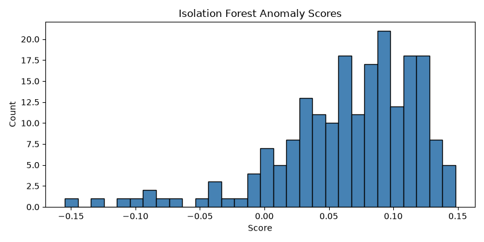
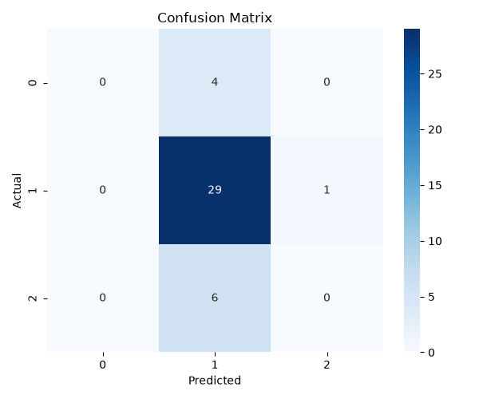

# AI-Powered Cybersecurity Threat Detection

> Industry-aligned student project — simulated intrusion, fraud, and anomaly detection using public network traffic data.





## Problem
Cyber threats grow faster than manual rules. Traditional IDS miss new patterns; AI adapts by learning normal behavior and flagging deviations.

## Industry Use
- Banks — fraud / account takeover detection
- IT / SaaS — intrusion prevention (IDS)
- Product / Security — SIEM dashboards

## Tech Stack
Python 3.10 · Pandas · NumPy · Scikit-learn · Matplotlib · Seaborn

## Architecture
`CSV (network logs)` → `Preprocess` → `Isolation Forest + Random Forest` → `Alert CSV + Confusion Matrix + Anomaly Chart`

## Quick Run
```bash
python -m venv venv
venv\Scripts\activate
pip install -r requirements.txt
python main.py
```
Outputs: `outputs/alerts.csv`, `outputs/confusion_matrix.png`, `outputs/anomaly_plot.png`

## Project Structure
```
├── data/              # dataset
├── src/               # modules (future)
├── outputs/           # predictions + charts
├── images/            # proof screenshots
├── docs/              # full guide
├── main.py            # pipeline
├── README.md          # this file
├── requirements.txt
└── .gitignore
```

## Proof / Status
- [x] Dataset loaded (simulated traffic)
- [x] Preprocessing pipeline
- [x] Isolation Forest (unsupervised)
- [x] Random Forest (supervised)
- [x] Metrics: Accuracy, Precision, Recall, F1
- [x] Confusion matrix + anomaly plot
- [x] GitHub-ready docs + README
- [ ] AWS / Lambda deployment (future)
- [ ] Continuous threat updates (future)

Built as proof-of-work for placements and internships.

---

## Architecture Diagram

```
[Network Traffic CSV] → [Preprocess: clean/encode/scale]
       ↓
[Isolation Forest] → [Anomaly Scores / Flags]
       ↓
[Random Forest]    → [Predicted Label (normal / DoS / probe)]
       ↓
[Alerts CSV] + [Confusion Matrix PNG] + [Anomaly Plot PNG]
```

## Screenshots / Proof
- `images/dataset_preview.png` — dataset sample
- `outputs/confusion_matrix.png` — model classification result
- `outputs/anomaly_plot.png` — anomaly score distribution
- `outputs/alerts.csv` — predicted labels with scores


## Future Improvements
- Real-world dataset: UNSW-NB15 / CICIDS2017 (larger scale)
- AWS Lambda / Cloud Function deployment for real-time inference
- Continuous update pipeline: automated retraining on new threat signatures
- Real-time dashboard (Streamlit / Dash) for SOC analysts
- Deep learning variant (autoencoders) for complex pattern detection

# Author
**Jayesh Rathi** — 3rd Year IT Student, Government College of Engineering, Amravati  
[LinkedIn](https://www.linkedin.com/in/jayesh-rathi-5ab8973b6) | [Email](mailto:jayeshrathinew@gmail.com)

# Badges


